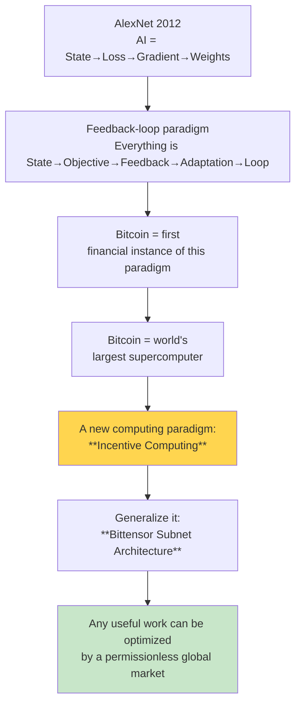

# AI × Crypto

  <strong>🌐 语言 / Language:</strong>
  
  

> **Focus**: Why must AI and crypto intersect? What problem does this combination solve that centralized AI cannot?

---

## Core Idea Chain

---

## Key Concepts

### Paradigms
- [[Incentive Computing.en]] · alongside ML / RL / GA
- [[Bitcoin as Supercomputer.en]]
- [[Bittensor Subnet Architecture.en]]

### Projects / Protocols
- [[Bittensor.en]] · the protocol itself
- [[Dynamic TAO]] · meta-level RL applied to incentive computing itself
- [[DePIN]] · Decentralized Physical Infrastructure Networks

### Applications
- [[Decentralized AI Training]]
- [[OpenRouter]]
- [[SWE-Bench]]
- [[Closed-Source AI vs Open-Source Crypto-AI]]

### People
- [[Const (Jacob Steeves).en]] · Bittensor founder

### Source Material
- [[About Bittensor 2025.en]] · Const's talk (33:15) — **required reading**

---

## Yet-to-Write Notes (placeholders)

These wikilinks are referenced but have no dedicated note yet. **When clicked, Obsidian will offer to create — don't accept blank files**:

- [[AlexNet]]
- [[Reinforcement Learning]]
- [[Gradient Descent]]
- [[Decentralized AI Training]]
- [[DePIN]]
- [[Dynamic TAO]]
- [[OpenRouter]]
- [[SWE-Bench]]
- [[Closed-Source AI vs Open-Source Crypto-AI]]

---

## Suggested Reading Order

1. **[[About Bittensor 2025.en]]** — full Const talk notes, establishes the big picture
2. **[[Bitcoin as Supercomputer.en]]** — counterintuitive "Bitcoin is a compute network, not money"
3. **[[Incentive Computing.en]]** — abstract this as a new paradigm
4. **[[Bittensor Subnet Architecture.en]]** — generalization mechanism
5. **[[Bittensor.en]]** — the actual protocol
