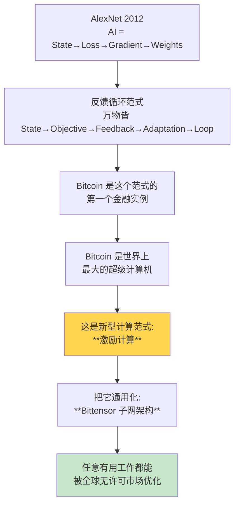

# AI × Crypto · AI 与加密货币交叉领域

  <strong>🌐 语言 / Language:</strong>
  
  

> **关注焦点**：AI 和加密货币的交叉为什么必须存在？它解决什么传统中心化 AI 无法解决的问题？

---

## 核心思想链

---

## 关键概念

### 范式
- [[Incentive Computing]] · 激励计算 (与 ML / RL / GA 并列)
- [[Bitcoin as Supercomputer]] · 比特币是超级计算机
- [[Bittensor Subnet Architecture]] · Bittensor 子网架构

### 项目 / 协议
- [[Bittensor]] · Bittensor 协议本身
- [[Dynamic TAO]] · 元层级 RL，把激励计算应用到自己
- [[DePIN]] · 去中心化物理基础设施网络（GPU 等）

### 应用
- [[Decentralized AI Training]] · 去中心化训练 LLM
- [[OpenRouter]] · 开源模型推理路由
- [[SWE-Bench]] · 编程 benchmark
- [[Closed-Source AI vs Open-Source Crypto-AI]] · 价值观对比

### 人物
- [[Const (Jacob Steeves)]] · Bittensor 创始人

### 原始素材
- [[About Bittensor 2025]] · Const 演讲（33:15）— **入门必读**

---

## 待写笔记 (placeholder)

以下 wikilinks 在已有笔记里被引用但还没有专门写概念笔记。**点击它们时 Obsidian 会问要不要创建——不要确认创建空文件**，要么手动写内容，要么让 Claude 帮你写：

- [[AlexNet]] · 2012 ImageNet 革命，AI 真正起飞的临界点
- [[Reinforcement Learning]] · 强化学习
- [[Gradient Descent]] · 梯度下降
- [[Decentralized AI Training]] · 70B 模型去中心化训练详解
- [[DePIN]] · 去中心化物理基础设施网络
- [[Dynamic TAO]] · 流动性动态分配机制
- [[OpenRouter]] · 模型推理路由平台
- [[SWE-Bench]] · 编程 benchmark
- [[Closed-Source AI vs Open-Source Crypto-AI]] · 价值观比较

---

## 阅读顺序建议

如果第一次接触这个领域，按下面顺序读：

1. **[[About Bittensor 2025]]** — 完整看 Const 的演讲笔记，建立全局图景
2. **[[Bitcoin as Supercomputer]]** — 理解 "Bitcoin 是计算网络，不是货币" 的反直觉
3. **[[Incentive Computing]]** — 把这种新范式抽象出来
4. **[[Bittensor Subnet Architecture]]** — 通用化机制
5. **[[Bittensor]]** — 落地的协议本身
