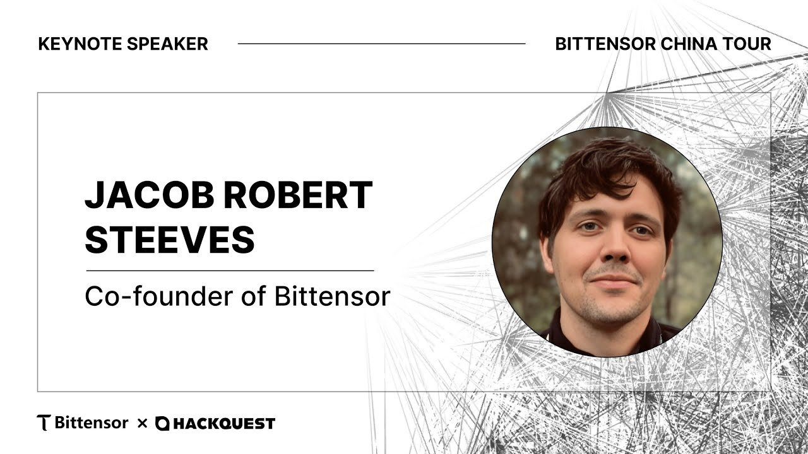
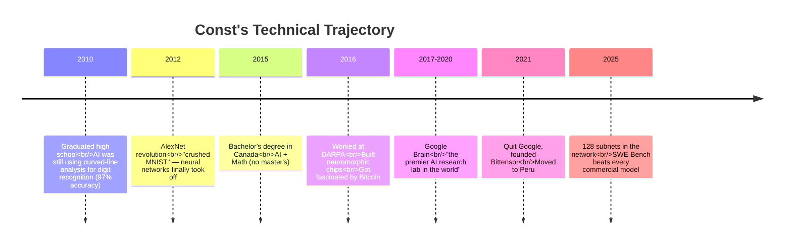
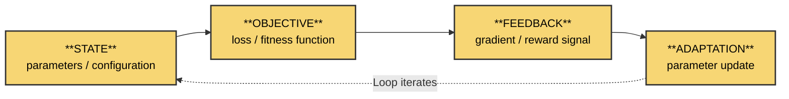
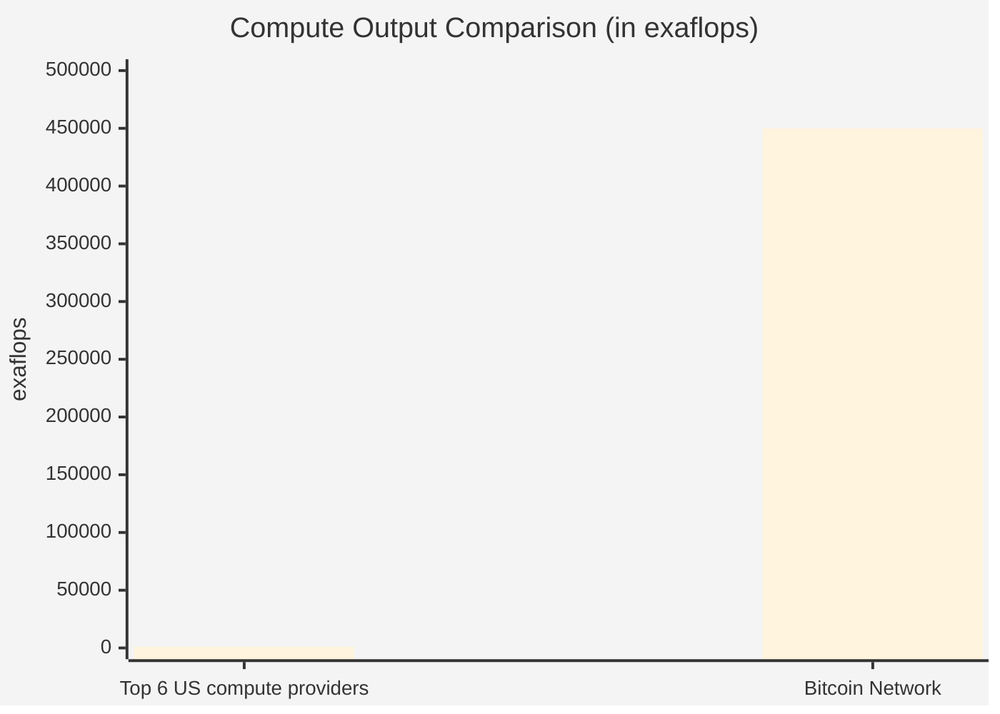
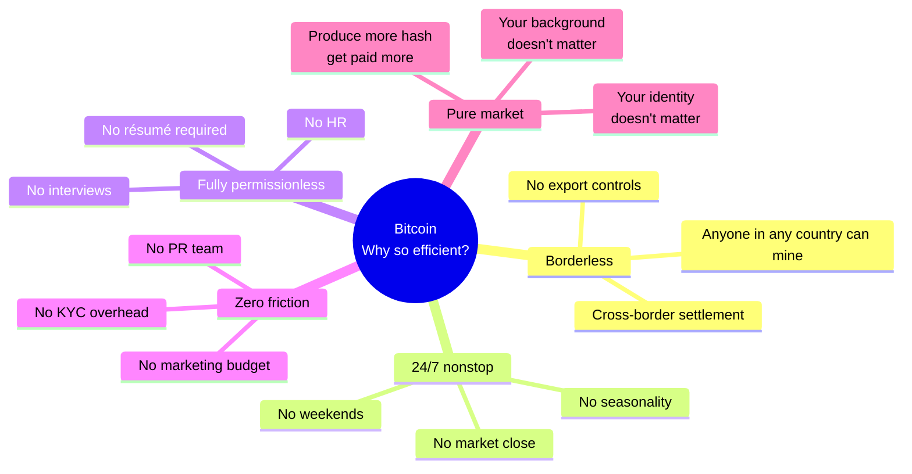
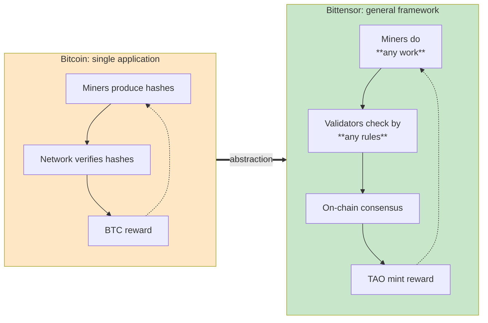
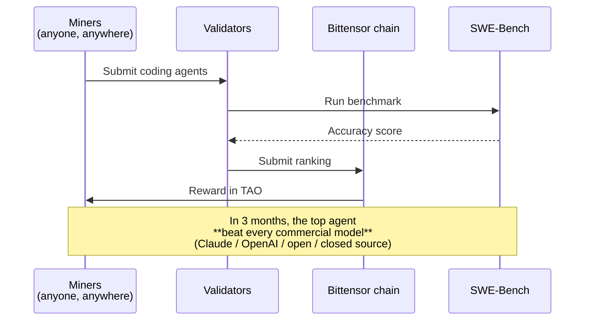
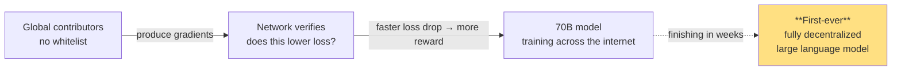
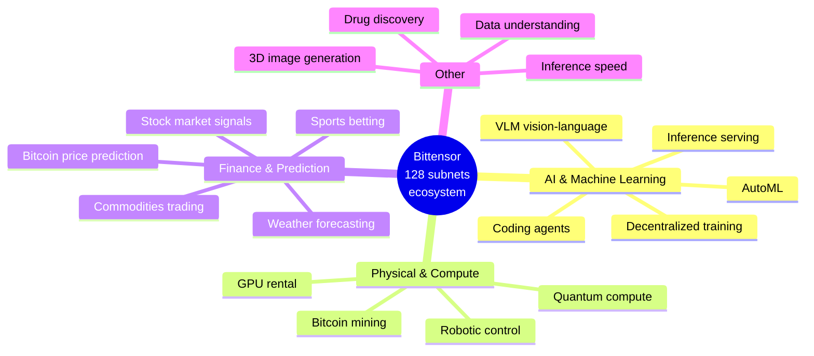
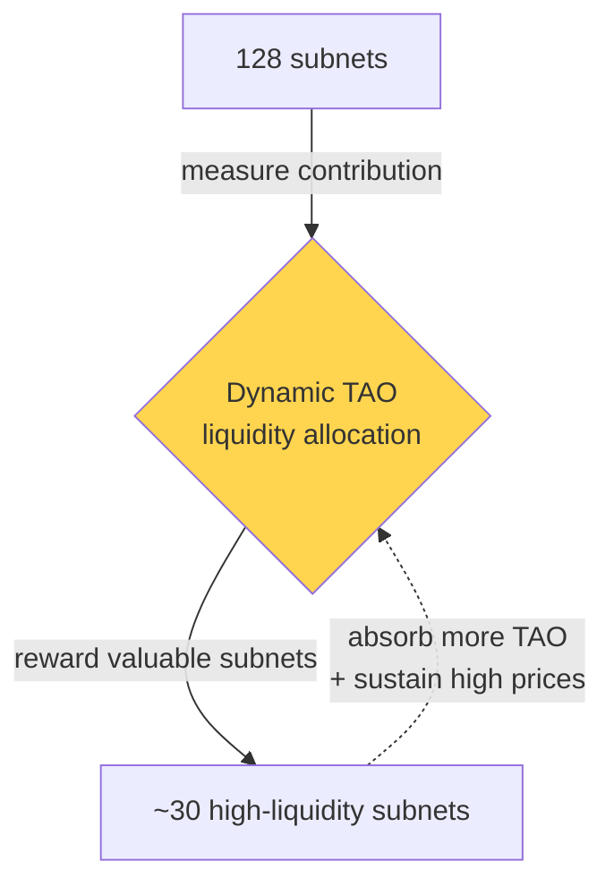

# About Bittensor 2025

<p align="right">
  <strong>🌐 语言 / Language:</strong>
  <a href="About%20Bittensor%202025.md"></a>
  <a href="About%20Bittensor%202025%20EN.md"></a>
</p>

> **TL;DR**: The speaker unifies AI (neural nets / RL / genetic algorithms), Bitcoin (an adaptive compute network), and biological systems (slime molds, trees, rivers) under a single **State → Objective → Feedback → Adaptation → Loop** pattern, and argues that Bittensor turns Bitcoin's incentive mechanism into a **general-purpose language** — letting a permissionless global market autonomously produce *any* useful intelligence.

**Author**: Const (Jacob Steeves) — Founder of Bittensor
**Source**: Hack Quest YouTube channel
**Date**: 2025
**Duration**: 33:15
**Transcript**: [[assets/About-Bittensor-2025-transcript.txt|Full English transcript]]



---

## Speaker Background



> Key self-positioning: "I'm **not** here to sell you a digital currency. We're not going to talk about prices or bullishness. I want to talk about why **this intersection of AI and crypto exists**, and why you should care."

---

## Central Thesis: A Unified Feedback Loop

The speaker keeps returning to this abstraction. He uses it to unify neural networks, reinforcement learning, genetic algorithms, slime molds, rivers, lightning, and Bitcoin — all into **one** pattern:



**Direct quote**: "All these things are one thing — state, objective, feedback, adaptation, a loop."

### Where Does This Pattern Show Up?

| System | State | Objective | Feedback | Adaptation |
|--------|-------|-----------|----------|------------|
| **Neural network** | Weights | Loss function | Gradient | Backpropagation |
| **Reinforcement learning** | Environment state | Reward | TD error | Policy update |
| **Genetic algorithm** | Population | Fitness | Ranking | Selection / mutation |
| **Slime mold solving maze** | Tendril distribution | Food direction | Protein gradient | Tendril growth / contraction |
| **Lightning** | Air potential field | Lowest-resistance path | Ionization feedback | Path collapse |
| **River delta** | Water flow paths | Gravity descent | Sediment feedback | Channel rerouting |
| **Bitcoin** | Miner distribution | Hash difficulty | Block reward | Hashpower flow |

> The speaker generalizes further: "**We as biological organisms are doing this too** — we're structures that adapt to maintain energy."

---

## Key Argument ① : The Real AI Revolution Happened in 2012

```mermaid
flowchart TB
    subgraph OldParadigm[Before 2012: Hand-coded]
        A1[Humans think about<br/>"what a digit looks like"] --> A2[Write curve detection<br/>+ length statistics]
        A2 --> A3[97% accuracy<br/>"actually really shitty"]
    end
    subgraph NewParadigm[After 2012 AlexNet]
        B1[Define loss function<br/>error rate] --> B2[Neural net learns weights]
        B2 --> B3[Gradient descent<br/>tunes parameters automatically]
        B3 --> B4[~100% accuracy]
        B4 -.learned features feed back.-> B1
    end
    OldParadigm ==> NewParadigm
    style OldParadigm fill:#f9d6d5
    style NewParadigm fill:#d4edda
```

**Key insight**: "Instead of pre-encoding the representations, **we let the model learn what to look for**." → **Adaptation replaces design**.

---

## Key Argument ② : Bitcoin is the World's Largest Supercomputer

The single most striking comparison in the talk (the speaker drew a bar chart to drive this home):



| Metric | Top 6 US compute providers (AWS / Azure / GCP+) | Bitcoin Network |
|--------|-----|-----|
| Capital invested | **~$1 trillion** | **$50B - $300B** |
| Compute (exaflops) | 1,000 | **450,000** |
| **Efficiency multiplier** | 1× | **700-9,000×** |
| Power draw | — | 23,000 MW (≈ all of Thailand) |
| Hashes/sec | — | 10²¹ |

> The speaker repeats: "**Let me say that again. Bitcoin is the largest supercomputer in the world.**"

### Why is it so absurdly efficient?



→ The speaker names this new computing paradigm **Incentive Computing** — peer to machine learning, reinforcement learning, and genetic programming.

---

## Key Argument ③ : Bittensor is the General-Purpose Language for Incentive Computing

Abstract away Bitcoin's specific application, and you get a general structure:



**Analogy**: Bittensor is to "incentive computing" what **PyTorch is to deep learning** — not a single application, but a *language for creating incentivized markets*.

---

## 6 Real-World Subnet Cases (the "wow moments" of the talk)

### Case 1️⃣ : Coding Intelligence Subnet (SWE-Bench)



- **The winner was a complete stranger** — they wrote a 7,000-line agent
- Top miner earns **~$60,000 per day**
- **Key insight**: "We did **not** build the AI agent. We **only defined the incentive function**, and let the agents evolve themselves."
- The speaker called it: "This felt exactly like 2012 when we first watched neural nets crush benchmarks."
- → This is **an AI lab with no engineers**.

### Case 2️⃣ : Decentralized Training of a 70B Model



- Anyone can contribute, no approval needed
- This is "**Bitcoin mining**" applied to LLM training
- At time of recording, the model was weeks from completion

### Case 3️⃣ : GPU Compute Market (DePIN)

- Miners rent out GPUs, network verifies authenticity, pays out
- **Cheapest GPU rental prices anywhere in the world**
- Chinese miners and others can plug in directly (permissionless, borderless)

### Case 4️⃣ : Inference Network

- Bittensor is the **largest open-source model inference provider on OpenRouter**
- **At peak**: served **more DeepSeek inference than DeepSeek itself**

### Case 5️⃣ : Robotics / Physical-World Optimization

- Miners contribute ML models for robots → tested in simulation → rewarded by performance
- The talk showed a drone flight trajectory demo in simulation

### Case 6️⃣ : 9 Other Subnet Categories



---

## Dynamic TAO: Applying Incentive Computing to Itself



"We applied ourselves to ourselves." — this is **meta-level RL**: let the market decide which markets should be funded.

---

## The Soul-Question: Why Should You Care?

The talk pivots sharply from technical to philosophical at the end — and this is the **most important** part:

```mermaid
flowchart LR
    subgraph ClosedAI[The closed-source AI world]
        C1[OpenAI valued at $100B]
        C2[Only 3,000 employees]
        C3[Effectively one person controls it]
        C4[You'll never work there]
        C5[Lifetime subscription fees]
        C6[Closed source, data black box]
        C7[Compute/data monopolized]
    end
    subgraph IncentiveCompute[The incentive computing world]
        I1[Anyone, anywhere can contribute]
        I2[Permissionless, borderless]
        I3[No HR / résumé filter]
        I4[You **own** part of the network]
        I5[Fully on-chain, transparent]
        I6[Compute/data/rewards all distributed]
    end
    ClosedAI -.we're being pushed here| Choice{Which side<br/>do you stand on?}
    IncentiveCompute -.the alternative we offer| Choice
    style ClosedAI fill:#ffcdd2
    style IncentiveCompute fill:#c8e6c9
    style Choice fill:#fff59d
```

> **Direct quote, translated**:
>
> "AI is being pulled into a small set of really small companies — they control all the compute and all the data, and there's nothing that you can access. **That's where everyone wants us to go.**
>
> But as a consequence of approaching these problems with this new and very powerful technology of *monetary optimization*, we also **distribute ownership, make the games transparent, let everyone participate, own, contribute, and access these digital commodities** in a more fair and open way.
>
> **That's why we're really doing this.**"

---

## Index of Key Visuals from the Talk

| # | Timestamp | Frame / diagram | Theme |
|---|-----------|----------------|-------|
| 1 | 2:11 | 2010 MNIST paper (curved-straight-line analysis) | Old paradigm: hand-coded |
| 2 | 4:00 | AlexNet architecture diagram | New paradigm: let the model learn |
| 3 | 5:30 | RL feedback loop | State-Action-Reward |
| 4 | 6:40 | Genetic algorithm evolution diagram | Selection + mutation |
| 5 | 7:14 | **Slime mold maze experiment** | Optimization without a brain |
| 6 | 8:30 | Tree / lightning / river delta comparison | Universal pattern in nature |
| 7 | 9:25 | "State / Objective / Feedback / Adaptation / Loop" abstract | **Core unification** |
| 8 | 11:25 | Bitcoin vs Top-6 compute providers bar chart | 700-9000× efficiency |
| 9 | 14:25 | Bitcoin's five advantages (borderless / 24×7 / permissionless / zero friction / pure market) | Incentive Computing |
| 10 | 17:30 | Bittensor general structure diagram | Miner → Validator → Chain → Mint |
| 11 | 18:50 | Miner ranking curve within a subnet | Adaptive culling mechanism |
| 12 | 20:40 | **SWE-Bench 3-month trajectory** | From lagging to network-best |
| 13 | 24:50 | 70B model decentralized training dashboard | Real-time loss curve |
| 14 | 26:20 | GPU price comparison table | Cheapest in the world |
| 15 | 29:20 | **9-subnet grid** | Breadth of applications |
| 16 | 30:50 | Dynamic TAO liquidity diagram | Meta-level RL |

> 💡 The video stream couldn't be frame-grabbed due to YouTube's anti-automation. If you want a specific frame, open the video at the timestamp, screenshot it, and drop it into `assets/`.

---

## Threads to Pull on Next

- [ ] [[Incentive Computing]] — write a standalone note defining the paradigm
- [ ] [[Bitcoin as Supercomputer]] — economic logic behind the efficiency gap
- [ ] [[Bittensor Subnet Architecture]] — engineering details of miner/validator/chain
- [ ] [[Decentralized AI Training]] — how the 70B model works in practice
- [ ] [[Dynamic TAO]] — meta-RL inside crypto incentives
- [ ] [[Closed-Source AI vs Open-Source Crypto-AI]] — values / governance comparison
- [ ] [[Const (Jacob Steeves)]] — full founder backstory

## Source

- URL: https://youtu.be/yRzc-WTyXXw
- Transcript (local cache): [[assets/About-Bittensor-2025-transcript.txt]]
- Thumbnail: ![[assets/video-thumbnail.jpg]]
- Fetched: 2026-06-23
- Method: yt-dlp via Clash Verge proxy (127.0.0.1:7897) + Chrome cookies + CDP transcript panel extraction
