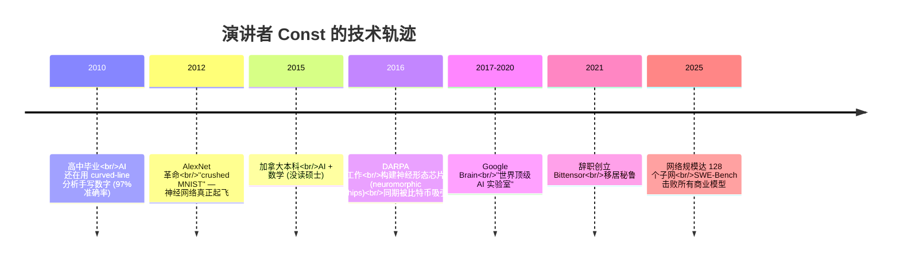
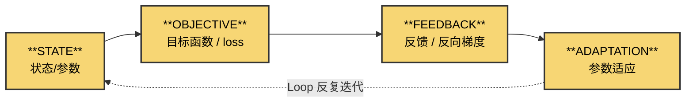
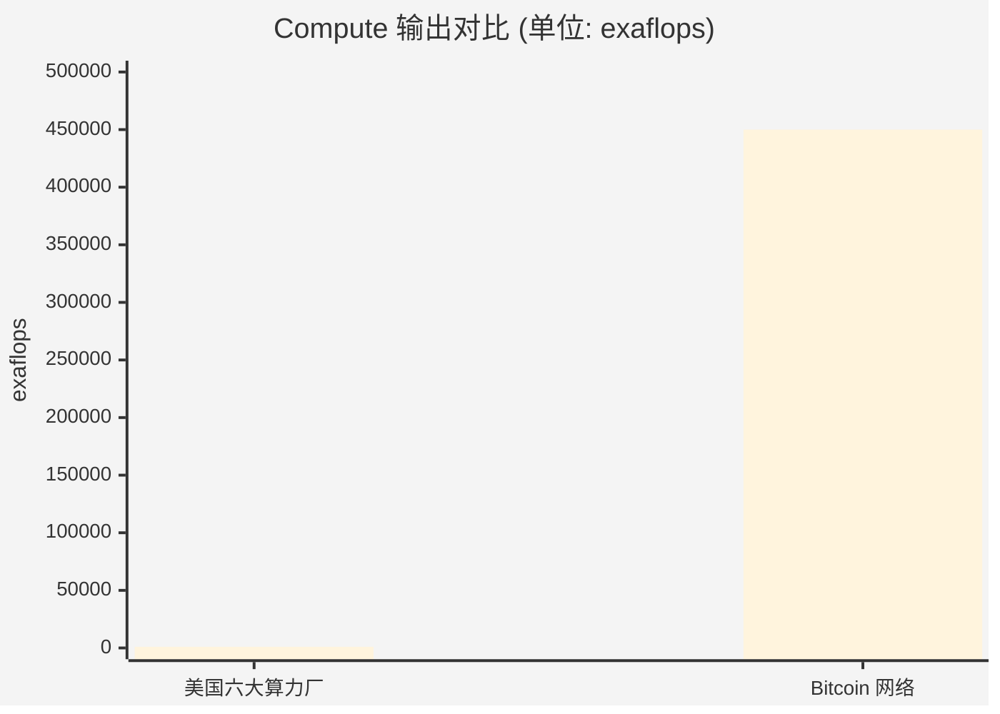
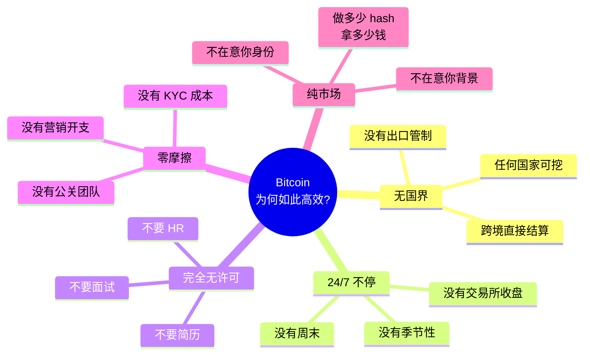
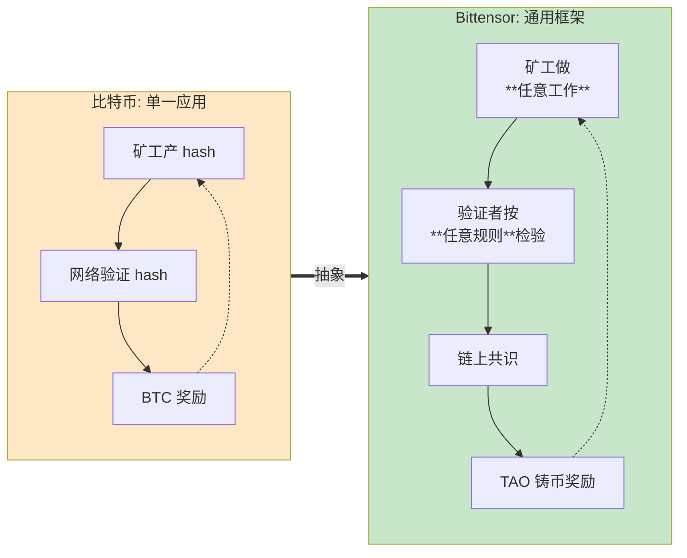
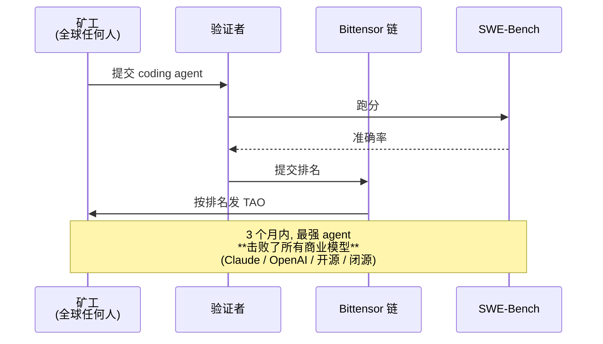
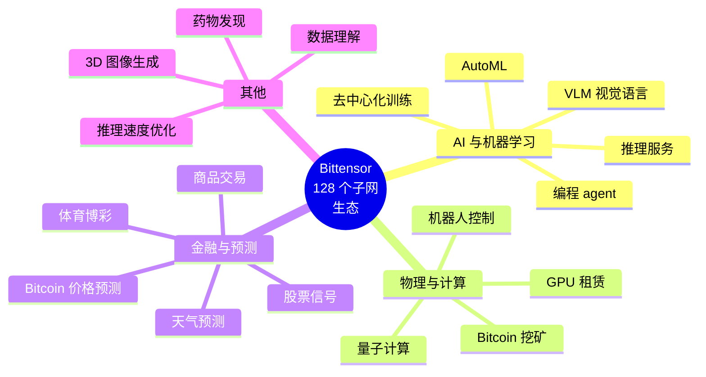
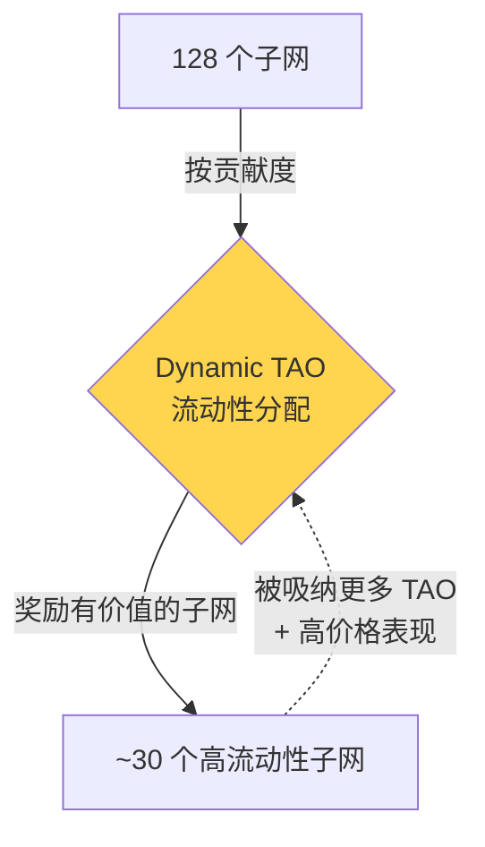

# About Bittensor 2025 · 关于 Bittensor 2025

<p align="right">
  <strong>🌐 语言 / Language:</strong>
  <a href="About%20Bittensor%202025.md"></a>
  <a href="About%20Bittensor%202025.en.md"></a>
</p>

> **一句话总结**：演讲者把 AI（神经网络/RL/遗传算法）、比特币（自适应算力网络）、生命系统（黏菌/树/河流）抽象成同一种「**State→Objective→Feedback→Adaptation→Loop**」的反馈循环模式，并提出 Bittensor 是把比特币的激励机制变成**通用语言**，让无许可全球市场自主生产任何有用智能。

**Author**: Const (Jacob Steeves) — Bittensor 创始人
**Source**: Hack Quest YouTube 频道
**Date**: 2025
**Duration**: 33:15
**Transcript**: [[assets/About-Bittensor-2025-transcript.txt|完整英文字幕]]


---

## 演讲者背景



> 关键自我定位：「我不是来卖币的，我们不谈价格、不谈牛市，我要谈的是 **AI × 加密货币这个交叉点为什么必须存在**」

---

## 核心论点：一个统一的反馈循环

视频反复回到这张抽象图，演讲者用它把神经网络、强化学习、遗传算法、黏菌、河流、闪电、比特币**全部统一**：



**演讲者原话**：「所有这些系统都是同一件事 — 状态、目标、反馈、适应、循环。」

### 这个模式在哪些地方出现？

| 系统 | State | Objective | Feedback | Adaptation |
|------|-------|-----------|----------|------------|
| **神经网络** | 权重 | loss 函数 | 梯度 | 反向传播 |
| **强化学习** | 环境状态 | 奖励 | TD error | 策略更新 |
| **遗传算法** | 种群 | 适应度 | 排名 | 选择/变异 |
| **黏菌走迷宫** | 触须分布 | 食物方向 | 蛋白质浓度梯度 | 触须生长/收缩 |
| **闪电** | 空气电势分布 | 最小阻抗路径 | 离子化反馈 | 路径塌缩 |
| **河三角洲** | 水流路径 | 重力下行 | 沉积反馈 | 河道改道 |
| **比特币** | 矿工分布 | hash 难度 | 区块奖励 | 算力流向 |

> 演讲者引申：「**我们作为生物体也是这样**—— 我们就是适应能量的结构。」

---

## 关键论点 ① ：AI 的真正革命发生在 2012

```mermaid
flowchart TB
    subgraph 旧范式[2012 之前: 人工编码]
        A1[人来想<br/>"数字长什么样"] --> A2[写曲线检测算法<br/>+ 长度统计公式]
        A2 --> A3[97% 准确率<br/>"actually really shitty"]
    end
    subgraph 新范式[2012 AlexNet 之后]
        B1[定义 loss 函数<br/>错误率] --> B2[神经网络学权重]
        B2 --> B3[梯度下降自动调参]
        B3 --> B4[~100% 准确率]
        B4 -.学到的特征| B1
    end
    旧范式 ==> 新范式
    style 旧范式 fill:#f9d6d5
    style 新范式 fill:#d4edda
```

**关键洞察**：「我们不再人工编码解决方案，我们**让模型自己学要看什么**。」 → 这是适应（adaptation）替代设计（design）。

---

## 关键论点 ② ：比特币是世界上最大的超级计算机

视频中**最震撼**的一个事实对比（演讲者画了一个柱状图来强调）：



| 指标 | 美国六大算力厂（AWS/Azure/GCP+） | Bitcoin 网络 |
|------|------|------|
| 投入资本 | **~1 万亿美元** | **500-3000 亿美元** |
| 算力（exaflops） | 1,000 | **450,000** |
| **效率倍数** | 1× | **700-9,000×** |
| 电力消耗 | — | 23,000 MW（=泰国全国） |
| 哈希产量 | — | 10²¹ /秒 |

> 演讲者反复强调：「**让我重复一遍。比特币是世界上最大的超级计算机。**」

### 为什么这么离谱地高效？



→ 演讲者把这种新型计算范式命名为 **Incentive Computing**（激励计算），与机器学习、强化学习、遗传编程并列。

---

## 关键论点 ③ ：Bittensor 是「激励计算的通用语言」

把比特币的具体逻辑抽象掉，得到通用结构：



**比喻**：Bittensor 之于"激励计算"，就像 **PyTorch 之于深度学习** —— 它不是单一应用，而是一种 **创建激励市场的语言**。

---

## 6 个真实子网案例（视频中的"震撼时刻"）

### 案例 1️⃣：编程智能子网（SWE-Bench）



- **击败者是个完全陌生的人**，写了 7000 行代码的 agent
- 顶级矿工**单日收入 ~$60,000**
- **关键洞察**：「我们没造 AI agent，**只定义了激励函数**，让 agent 自己进化出来」
- 演讲者形容："感觉就像 2012 年看 AlexNet 击碎 benchmark 那一刻"
- → 这是「**没有工程师的 AI 实验室**」

### 案例 2️⃣：去中心化训练 70B 大模型


- 谁都可以贡献，没有审批
- 这是「**比特币挖矿模式**」应用到 LLM 训练
- 录制时距完成还有几周

### 案例 3️⃣：GPU 算力市场（DePIN）

- 矿工出租 GPU，网络验证 GPU 真实性后付费
- **全球最便宜的 GPU 租用价格**
- 中国矿工等可直接接入（无许可、无国界）

### 案例 4️⃣：推理网络

- Bittensor 是 **OpenRouter 上最大的开源模型推理供应商**
- **巅峰时**：跑 DeepSeek 的推理量 **比 DeepSeek 官方还多**

### 案例 5️⃣：机器人 / 物理世界优化

- 矿工贡献机器人 ML 模型 → 在仿真环境跑 → 按性能发奖励
- 视频里展示了无人机在仿真中飞行轨迹的 demo

### 案例 6️⃣：9 类杂项子网



---

## Dynamic TAO：把激励计算应用到激励计算自身



「我们对自己应用了自己」—— 这是**元层级**的强化学习：让市场自己决定哪些市场该被资助。

---

## 灵魂拷问：为什么你应该关注？

视频结尾从技术陡然转向价值观，这是**最重要的部分**：

```mermaid
flowchart LR
    subgraph 闭源AI[闭源 AI 的世界]
        C1[OpenAI 估值 $100B]
        C2[只有 3000 员工]
        C3[实质一人控制]
        C4[你永远进不去]
        C5[你一辈子付订阅费]
        C6[闭源、数据黑箱]
        C7[算力/数据被垄断]
    end
    subgraph 激励计算[激励计算的世界]
        I1[全球任何人都能贡献]
        I2[无许可、无国界]
        I3[没有 HR / 简历筛选]
        I4[你**持有**网络所有权]
        I5[全链上、完全透明]
        I6[算力/数据/收益都分布式]
    end
    闭源AI -.我们都被推向这里| 选择{你站哪一边?}
    激励计算 -.我们提供的替代| 选择
    style 闭源AI fill:#ffcdd2
    style 激励计算 fill:#c8e6c9
    style 选择 fill:#fff59d
```

> **演讲者原话翻译**：
>
> 「AI 正在被拉进一个极小的公司圈子，他们控制所有算力和数据，你毫无访问权——**这就是所有人想把我们推向的方向**。
>
> 但我们用'货币优化'这种新工具去解决同一批问题时，顺带也在**分配所有权、让游戏变透明，让所有人都能参与、拥有、贡献、访问这些数字商品**。
>
> **这才是我们真正在做这件事的原因。**」

---

## 视频中的关键画面索引

| # | 时间点 | 画面/图示 | 主旨 |
|---|--------|----------|------|
| 1 | 2:11 | 2010 年 MNIST 论文（curved-straight-line 分析）| 旧范式：人工编码 |
| 2 | 4:00 | AlexNet 神经网络架构 | 新范式：让模型自己学 |
| 3 | 5:30 | RL 反馈循环图 | State-Action-Reward |
| 4 | 6:40 | 遗传算法演化图 | 选择 + 变异 |
| 5 | 7:14 | **黏菌走迷宫**实验图 | 没有大脑也能解优化 |
| 6 | 8:30 | 树/闪电/河三角洲对比 | 自然界普适模式 |
| 7 | 9:25 | "State / Objective / Feedback / Adaptation / Loop" 抽象图 | **核心统一框架** |
| 8 | 11:25 | Bitcoin vs 美国六大厂柱状图 | 算力效率 700-9000× |
| 9 | 14:25 | Bitcoin 五大优势（无国界/24×7/无许可/零摩擦/纯市场）| Incentive Computing |
| 10 | 17:30 | Bittensor 通用激励计算机结构图 | 矿工→验证者→链→铸币 |
| 11 | 18:50 | 子网内矿工排名曲线图 | 自适应淘汰机制 |
| 12 | 20:40 | **SWE-Bench 3 个月跑分**走势图 | 从落后到全网第一 |
| 13 | 24:50 | 70B 模型分布式训练 dashboard | 实时 loss 曲线 |
| 14 | 26:20 | GPU 价格对比表 | 全球最便宜 |
| 15 | 29:20 | **9 子网九宫格** | 应用范围之广 |
| 16 | 30:50 | Dynamic TAO 流动性图 | 元层级 RL |

> 💡 视频流被 YouTube 反自动化限制无法逐帧截图。如需补充某个具体画面，自行打开视频对应时间点截图后放入 `assets/` 即可。

---

## 可以深入的方向

- [ ] [[Incentive Computing]] — 写一份独立笔记定义这个新范式
- [ ] [[Bitcoin as Supercomputer]] — 详细比对算力效率背后的经济逻辑
- [ ] [[Bittensor Subnet Architecture]] — 矿工/验证者/链协议的工程细节
- [ ] [[Decentralized AI Training]] — 70B 模型实现原理
- [ ] [[Dynamic TAO]] — 元强化学习如何在加密激励中实现
- [ ] [[Closed-Source AI vs Open-Source Crypto-AI]] — 价值观/治理对比
- [ ] [[Const (Jacob Steeves)]] — 创始人完整背景

## Source

- URL: https://youtu.be/yRzc-WTyXXw
- Transcript (本地缓存): [[assets/About-Bittensor-2025-transcript.txt]]
- Thumbnail: ![[assets/video-thumbnail.jpg]]
- 抓取日期: 2026-06-23
- 抓取方式: yt-dlp via Clash Verge proxy (127.0.0.1:7897) + Chrome cookies + CDP transcript panel extraction
