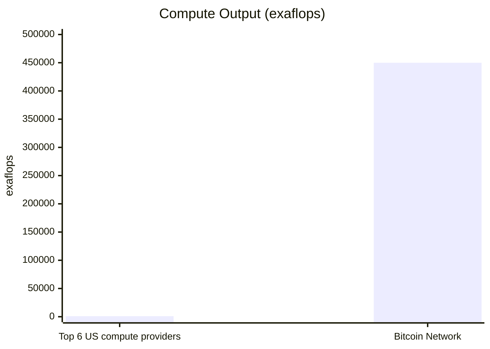
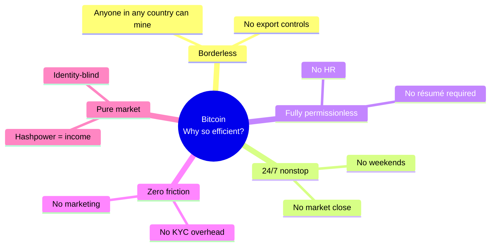

# Bitcoin as Supercomputer

  <strong>🌐 语言 / Language:</strong>
  
  

> **Central thesis**: Bitcoin is not "digital money" — it is **the largest supercomputer on Earth**, a borderless 24/7 self-adaptive compute network whose hashpower is **450× greater than the combined output of the top six US compute providers**.

---

## The Numbers

| Metric | Top 6 US compute providers | Bitcoin Network |
|--------|---|---|
| Capital invested | ~$1 trillion | $50B - $300B |
| Compute (exaflops) | 1,000 | **450,000** |
| **Efficiency multiplier** | 1× | **700 - 9,000×** |
| Power draw | — | 23,000 MW (≈ all of Thailand) |
| Hashes/sec | — | 10²¹ |

---

## Why is it so absurdly efficient?

Bitcoin has five properties that traditional corporations **structurally cannot replicate**:

Any corporation trying to match this efficiency would need HR, hiring pipelines, marketing budgets, compliance teams — Bitcoin operates without any of these **friction costs**.

---

## The first instance of [[Incentive Computing.en]]

Bitcoin's essence is an **incentive-driven self-adaptive optimization system**:

- **State**: Distribution of miner hardware
- **Objective**: Work measured in hash difficulty
- **Feedback**: BTC block rewards
- **Adaptation**: Hashpower flows toward most-profitable nodes
- **Loop**: Every 10 minutes

This structure ≡ a neural network's **State → Objective → Feedback → Adaptation → Loop** (see [[About Bittensor 2025.en]]).

---

## The generalization: Incentive Computing

If this mechanism produces the largest supercomputer in history, can it produce **other useful things**?

- Training LLMs? → Yes ([[Decentralized AI Training.en]])
- Renting GPUs? → Yes ([[DePIN]])
- Inference? → Yes
- Coding agents? → Yes (see [[About Bittensor 2025.en]], Case 1)

This is the core proposition of [[Bittensor]].

---

## Source

- Const (Jacob Steeves), [[About Bittensor 2025.en]] talk — core argument in the 11:00–16:30 segment.
