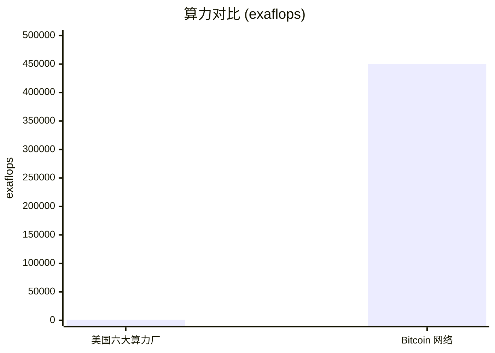
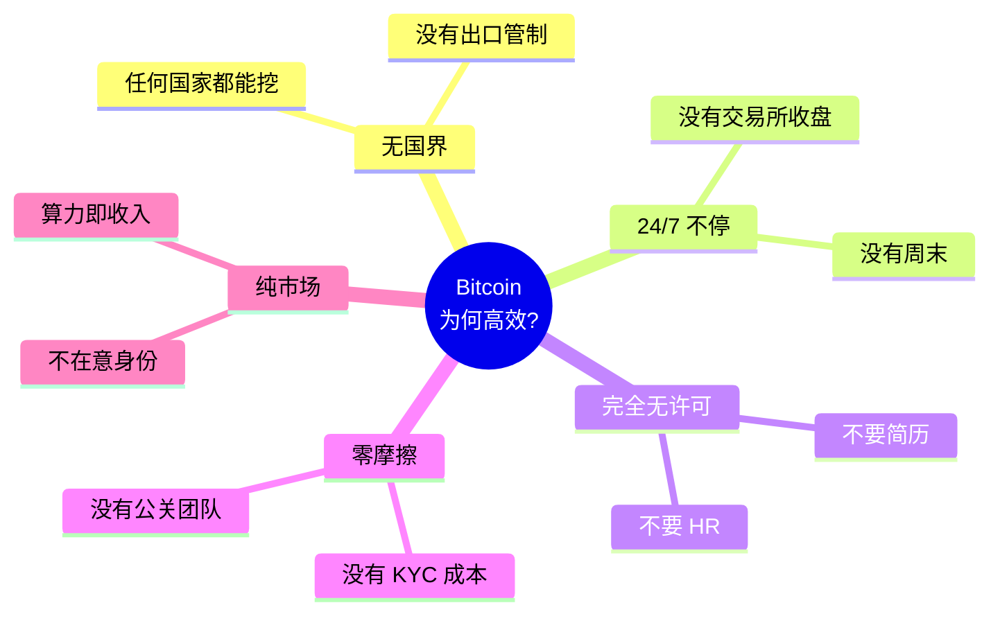

# Bitcoin as Supercomputer · 比特币是超级计算机

  <strong>🌐 语言 / Language:</strong>
  
  

> **核心论点**：Bitcoin 不是一种"数字货币"，而是**世界上最大的超级计算机**——一个跨国界、24/7 自适应运行的计算网络，其算力相当于美国六大云服务商总和的 **450 倍**。

---

## 数据对比（震撼时刻）

| 指标 | 美国六大算力厂（AWS / Azure / GCP+） | Bitcoin 网络 |
|------|---|---|
| 资本投入 | ~$1 万亿 | $50B - $300B |
| 算力（exaflops）| 1,000 | **450,000** |
| **效率倍数** | 1× | **700 - 9,000×** |
| 电力消耗 | — | 23,000 MW（≈ 泰国全国） |
| 哈希/秒 | — | 10²¹ |

---

## 为什么这么离谱地高效？

Bitcoin 拥有传统公司**永远做不到**的五大特性：

任何公司若要追赶这种效率，必须有 HR、有招聘流程、有营销开支、要遵守各国劳动法——而 Bitcoin 不需要任何这些**摩擦成本**。

---

## 这是 [[Incentive Computing]] 的第一个实例

Bitcoin 的本质是一个**激励驱动的自适应优化系统**：

- **State**：矿工的硬件分布
- **Objective**：以 hash 难度衡量的工作量
- **Feedback**：BTC 区块奖励
- **Adaptation**：算力向最赚钱的地方流动
- **Loop**：每 10 分钟一次

这个结构 ≡ 神经网络的 **State → Objective → Feedback → Adaptation → Loop**（见 [[About Bittensor 2025]]）。

---

## 启发：通用激励计算

如果同样的机制能让 Bitcoin 产生历史上最大的算力，那么它能不能用来生产**其他有用的东西**？

- 训练 LLM 模型？ → 是的（[[Decentralized AI Training]]）
- 出租 GPU？ → 是的（[[DePIN]]）
- 跑推理？ → 是的
- 编程 agent？ → 是的（[[About Bittensor 2025]] 案例 1）

这就是 [[Bittensor]] 的核心命题。

---

## 来源

- Const (Jacob Steeves) 在 [[About Bittensor 2025]] 演讲中的核心论点（11:00 - 16:30 段落）
