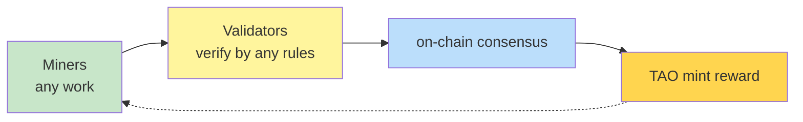

# Bittensor Subnet Architecture

<p align="right">
  <strong>🌐 语言 / Language:</strong>
  <a href="Bittensor%20Subnet%20Architecture.md"></a>
  <a href="Bittensor%20Subnet%20Architecture.en.md"></a>
</p>

> **Core**: Bittensor **abstracts** Bitcoin's "miners produce hashes → validators verify hashes → network mints rewards" mechanism. Each **subnet** is an independent "incentive market" where you can define what counts as valuable work with arbitrary rules.

---

## The Generic Structure



Every subnet follows this 4-stage loop. Subnet designers only need to define **two things**:

1. **What is "work"** — coding agents? training gradients? GPU resources? inference endpoints? stock signals?
2. **How to judge work quality** — benchmark scores? loss reduction rate? response latency?

Define these two, and the market runs.

---

## Roles: Miners and Validators

| Role | Task | Income |
|------|------|--------|
| **Miners** | Produce work — agents, gradients, GPU compute, inference endpoints | Earn TAO by ranking |
| **Validators** | Verify miner work quality, produce rankings | Also earn TAO (verification incentive) |
| **Subnet Owner** | Design subnet logic, define scoring rules | Take subnet fees |

**Key point**: Validators **calibrate against each other** — no single validator decides. Multiple validator scores are aggregated via the **Yuma Consensus** algorithm.

---

## Ranking Curve and Culling

Within each subnet, miners are ranked along a curve:

```
performance ▲
  ┃        ━━━━━━━━━━ Top miners (large rewards)
  ┃      ╱
  ┃    ╱
  ┃  ╱   ━━ Middle (small rewards)
  ┃ ╱  ━━ Bottom (zero, culled)
  ┃╱
  ┗━━━━━━━━━━━━━━━━━━▶ Miner rank
```

Bottom miners get culled, new miners join, and the network **continuously self-adapts** — this is the essence of [[Incentive Computing.en]].

---

## Comparison with Bitcoin

| Dimension | Bitcoin | Bittensor |
|-----------|---------|-----------|
| What miners do | Only hashes (useless work) | **Any useful work** |
| Who judges | Protocol auto-verifies hashes | Validators score by subnet rules |
| Single app vs. framework | Single app | **General framework** |
| Number of subnets | 1 | 128 (as of 2025) |

**Analogy**: Bitcoin is to "incentive computing" what **MNIST is to deep learning** — the first demo. Bittensor is the **PyTorch** — the general language.

---

## 6 Real-World Subnet Cases

See [[About Bittensor 2025.en]] "6 Real-World Subnet Cases":

1. **Coding Intelligence Subnet (SWE-Bench)** — beat every commercial LLM in 3 months
2. **Decentralized Training of 70B Model** — permissionless global gradient contribution
3. **GPU Compute Market (DePIN)** — cheapest GPU rental in the world
4. **Inference Network** — largest open-source model provider on OpenRouter
5. **Robotics / Physical-World Optimization** — miners contribute ML models
6. **9 other subnet categories** — stocks, betting, drug discovery, quantum, 3D, etc.

---

## Meta-level: [[Dynamic TAO]]

Bittensor also **applies this mechanism to itself** — subnets compete for "liquidity allocation," with TAO liquidity auto-distributed by contribution. See [[Dynamic TAO]].

---

## Source

- Const (Jacob Steeves), [[About Bittensor 2025.en]] talk — segment 17:30–23:00 ("general incentive computer" section and the 6 subnet case studies).
