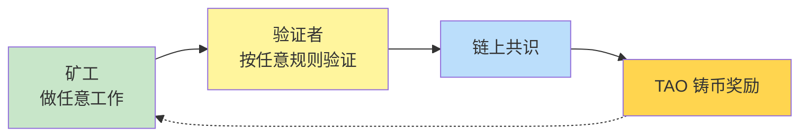

# Bittensor Subnet Architecture · Bittensor 子网架构

<p align="right">
  <strong>🌐 语言 / Language:</strong>
  <a href="Bittensor%20Subnet%20Architecture.md"></a>
  <a href="Bittensor%20Subnet%20Architecture.en.md"></a>
</p>

> **核心**：Bittensor 把 Bitcoin "矿工产 hash → 验证者验 hash → 网络发奖励" 这个机制**抽象化**，每个 **subnet（子网）** 就是一个独立的"激励市场"，可以用任意规则定义"什么是有价值的工作"。

---

## 通用结构



任何子网都遵循这个四阶段循环。子网设计者**只需要定义两件事**：

1. **"工作"是什么** — 编程 agent？训练梯度？GPU 算力？推理服务？股票信号？
2. **怎么判断工作好坏** — benchmark 跑分？loss 下降速度？响应延迟？

定义这两件事，市场就能跑起来。

---

## 矿工与验证者角色

| 角色 | 任务 | 收入来源 |
|------|------|---------|
| **Miners** | 产生"工作"——agent、梯度、GPU 资源、推理 endpoint | 按排名拿 TAO 铸币 |
| **Validators** | 检验矿工的工作质量，给出排名 | 也拿 TAO（验证激励） |
| **Subnet Owner** | 设计子网逻辑、定义评分规则 | 收取子网手续费 |

**关键点**：验证者**互相校准**——不是某一个验证者说了算，而是多个验证者的评分通过 Yuma Consensus 共识算法聚合。

---

## 排名曲线与淘汰

每个子网内部，矿工被按表现排成一条曲线：

```
表现 ▲
  ┃        ━━━━━━━━━━ Top miners (拿大头奖励)
  ┃      ╱
  ┃    ╱
  ┃  ╱   ━━ 中段 (少量奖励)
  ┃ ╱  ━━ 末位 (零奖励, 被淘汰)
  ┃╱
  ┗━━━━━━━━━━━━━━━━━━▶ 矿工排名
```

末位被淘汰，新矿工不断加入，整个网络在**持续自适应进化**——这就是 [[Incentive Computing]] 的精髓。

---

## 与 Bitcoin 的对比

| 维度 | Bitcoin | Bittensor |
|------|---------|-----------|
| 矿工干什么 | 只能产 hash（无用功） | **任意有用的工作** |
| 谁评判 | 网络协议自动验证 hash | 验证者按子网规则评分 |
| 单一应用 vs 通用框架 | 单一应用 | **通用框架** |
| 子网数量 | 1 | 128（截至 2025）|

**类比**：Bitcoin 之于"激励计算"，相当于 **MNIST 之于深度学习**——第一个 demo。Bittensor 才是 **PyTorch** ——通用语言。

---

## 6 个实际子网案例

详见 [[About Bittensor 2025]] 的 "6 个真实子网案例" 部分：

1. **编程智能子网（SWE-Bench）** — 3 个月击败所有商业 LLM
2. **去中心化训练 70B 模型** — 全球无许可贡献梯度
3. **GPU 算力市场（DePIN）** — 全球最便宜的 GPU 租用
4. **推理网络** — OpenRouter 上最大的开源模型推理供应商
5. **机器人 / 物理世界优化** — 矿工贡献 ML 模型
6. **9 类杂项子网** — 股票、博彩、药物、量子计算、3D 生成等

---

## 元层级：[[Dynamic TAO]]

Bittensor 还把这个机制**应用到自己身上**——子网之间也竞争"流动性分配"，按贡献度自动分配 TAO 流动性。详见 [[Dynamic TAO]]。

---

## 来源

- Const (Jacob Steeves), [[About Bittensor 2025]] 演讲 17:30 - 23:00 段落（"通用激励计算机"章节及 6 个子网案例）
