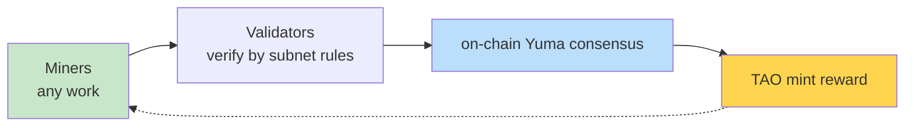
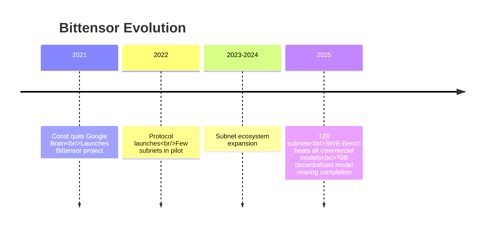

# Bittensor

  <strong>🌐 语言 / Language:</strong>
  
  

> **In one line**: Bittensor is the **general-purpose framework** for [[Incentive Computing.en]] — it abstracts [[Bitcoin as Supercomputer.en|Bitcoin's mining mechanism]] into a **programming language** that lets any "what counts as valuable work" definition be optimized by a permissionless global market.

---

## Core Thesis

**Bittensor is to "incentive computing" what PyTorch is to deep learning.**

| Dimension | Bitcoin | Bittensor |
|-----------|---------|-----------|
| Nature | Single application | **General framework** |
| Miner work | Hashes only (useless) | **Any useful work** |
| Rule definition | Hard-coded in protocol | Each subnet defines its own |
| Subnet count | 1 | 128 |

---

## Core Architecture

See [[Bittensor Subnet Architecture.en]] for details. In short:

---

## Applications (128 subnets, each an independent market)

| Category | Example subnet |
|----------|----------------|
| 💻 Coding intelligence | SWE-Bench subnet (beat all commercial LLMs) |
| 🧠 Model training | [[Decentralized AI Training\|70B decentralized training]] |
| 🖥 Compute market | [[DePIN\|GPU rental]] |
| 🚀 Inference | Largest open-source model provider on OpenRouter |
| 🤖 Robotics | Robot ML model simulation competition |
| 📊 Financial prediction | Stock signals, commodities, BTC price prediction |
| 🧪 Science | Drug discovery, weather forecasting, quantum compute |
| 🎨 Creative | 3D image generation, VLM vision-language |

Full list: see "9 other subnet categories" mindmap in [[About Bittensor 2025.en]].

---

## Key People

- [[Const (Jacob Steeves).en]] — Founder, ex-Google Brain
- HQ: Open Tensor Foundation
- Location: Peru (Const moved there)

---

## TAO Token

- **TAO** is Bittensor's native token, minted via Bitcoin-style block rewards
- Current issuance uses [[Dynamic TAO]] — dynamically allocates liquidity by subnet contribution
- **Don't focus on price** — Const's talk explicitly says "we're not going to talk about prices or bullishness"

---

## Historical Timeline

---

## Sources & Entry Points

- 📺 **Core intro**: [[About Bittensor 2025.en]] (Const's talk, 33:15)
- 🔬 **Architecture details**: [[Bittensor Subnet Architecture.en]]
- 💰 **Meta-mechanism**: [[Dynamic TAO]]
- 🌐 Website: bittensor.com (TBD)
