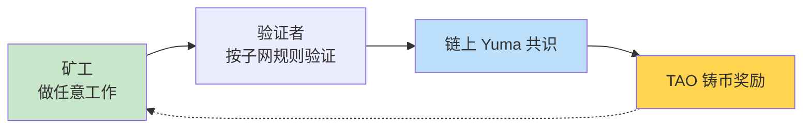
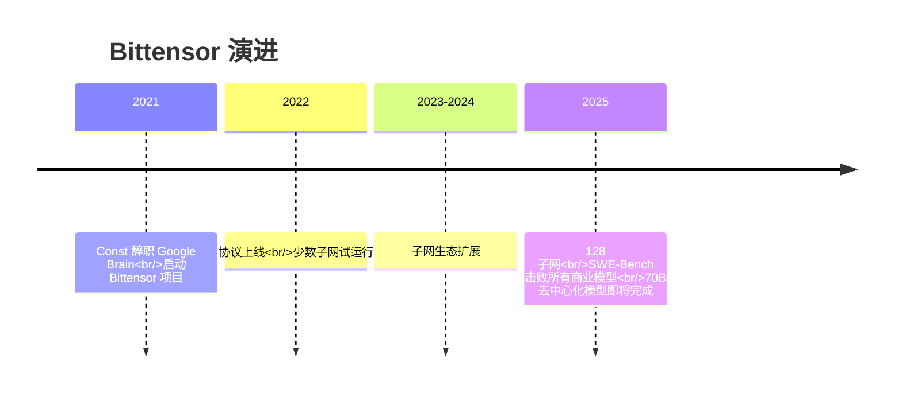

# Bittensor · 通用激励计算网络

  <strong>🌐 语言 / Language:</strong>
  
  

> **一句话**：Bittensor 是 [[Incentive Computing]] 的**通用框架**——把 [[Bitcoin as Supercomputer|比特币挖矿机制]] 抽象成一种**编程语言**，让任意"什么是有价值的工作"都能被一个全球无许可市场优化。

---

## 核心命题

**Bittensor 之于"激励计算"，相当于 PyTorch 之于深度学习。**

| 维度 | Bitcoin | Bittensor |
|------|---------|-----------|
| 性质 | 单一应用 | **通用框架** |
| 矿工干什么 | 只能产 hash（无用） | **任意有用工作** |
| 谁定规则 | 协议硬编码 | 每个子网自己定 |
| 子网数 | 1 | 128 |

---

## 核心架构

详见 [[Bittensor Subnet Architecture]]。简而言之：

---

## 实际应用 (128 子网, 各自一个独立市场)

| 类别 | 代表子网 |
|------|---------|
| 💻 编程智能 | SWE-Bench 子网（击败所有商业 LLM） |
| 🧠 模型训练 | [[Decentralized AI Training\|70B 去中心化训练]] |
| 🖥 算力市场 | [[DePIN\|GPU 租赁]] |
| 🚀 推理服务 | OpenRouter 上最大开源模型供应商 |
| 🤖 机器人 | 机器人 ML 模型仿真竞赛 |
| 📊 金融预测 | 股票信号、商品交易、Bitcoin 价格预测 |
| 🧪 科学 | 药物发现、天气预测、量子计算 |
| 🎨 创作 | 3D 图像生成、VLM 视觉语言 |

完整列表见 [[About Bittensor 2025]] 的 "9 类杂项子网" 图。

---

## 关键人物

- [[Const (Jacob Steeves)]] —— Bittensor 创始人，Google Brain 前员工
- 总部：Open Tensor Foundation（基金会）
- 居住地：秘鲁（Const 移居）

---

## TAO 代币

- **TAO** 是 Bittensor 的原生代币，铸币机制类似 Bitcoin（区块奖励）
- 当前发行用 [[Dynamic TAO]] 机制，按子网"对网络的贡献"动态分配流动性
- **不要关注价格**——Const 演讲明确说"我们不谈价格、不谈牛市"

---

## 历史时间线

---

## 来源 & 入口

- 📺 **核心入门**：[[About Bittensor 2025]] (Const 演讲, 33:15)
- 🔬 **架构细节**：[[Bittensor Subnet Architecture]]
- 💰 **元层级机制**：[[Dynamic TAO]]
- 🌐 官网：bittensor.com (待补全)
