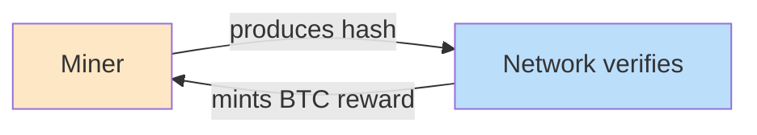

# Incentive Computing

<p align="right">
  <strong>🌐 语言 / Language:</strong>
  <a href="Incentive%20Computing.md"></a>
  <a href="Incentive%20Computing.en.md"></a>
</p>

> **Definition**: A new computing paradigm driven by **economic incentives**. Define "what counts as valuable work" via an incentive function, and let a permissionless global market **self-organize and self-optimize** to produce that work.

---

## Parallel to Other Computing Paradigms

```mermaid
flowchart LR
    ML[Machine Learning] -.|gradient descent| Adaptation
    RL[Reinforcement Learning] -.|env-reward loop| Adaptation
    GA[Genetic Programming] -.|select-mutate-cull| Adaptation
    IC[**Incentive Computing**] -.|economic incentive-market cull| Adaptation

    Adaptation[**Feedback-Loop Paradigm**<br/>State → Objective → Feedback → Adaptation → Loop]

    style IC fill:#ffd54f
    style Adaptation fill:#c8e6c9
```

All four are **feedback-loop-driven optimization paradigms** — they differ only in what the feedback signal is:
- ML: loss / gradient
- RL: reward
- GA: fitness ranking
- **IC: actual monetary market reward**

---

## Key Properties

What makes incentive computing **structurally** orders-of-magnitude more efficient than traditional organizations:

| Property | Description |
|----------|-------------|
| **Borderless** | Anyone, anywhere can participate |
| **24/7 nonstop** | No weekends, seasons, market closes |
| **Permissionless** | No résumé, no HR, no interviews |
| **Zero friction** | No KYC cost, no PR, no marketing |
| **Pure market** | Income ≡ work; **identity-blind** |

⟶ No traditional organization can **structurally** replicate these properties — that's why Bitcoin produces **700-9000×** the compute efficiency of the top 6 US compute providers (see [[Bitcoin as Supercomputer.en]]).

---

## First Instance: Bitcoin

Bitcoin is the **first demo** of incentive computing — it proves the paradigm works at global scale. But it only optimizes **one thing**: hashpower.



See [[Bitcoin as Supercomputer.en]].

---

## Generalization: [[Bittensor Subnet Architecture.en]]

If this mechanism produced the largest supercomputer in history, **why not let it optimize other things**?

[[Bittensor]] abstracts Bitcoin's specific logic into a "general incentive computer" — each subnet is an independent incentive market with arbitrary "what counts as valuable work" rules:

- Coding agents (SWE-Bench subnet)
- Distributed LLM training ([[Decentralized AI Training]])
- GPU compute market ([[DePIN]])
- Inference serving
- Stock signals, weather forecasting, drug discovery, quantum compute…

---

## Analogy

| Deep Learning | Incentive Computing |
|---------------|---------------------|
| MNIST (single-app demo) | Bitcoin |
| PyTorch (general framework) | [[Bittensor]] |
| TensorFlow / JAX | (future incentive-computing frameworks) |

Incentive computing : Bitcoin :: deep learning : MNIST — the latter proved the idea works; the former unfolds into a full general-purpose toolkit and countless applications.

---

## Source

- [[Const (Jacob Steeves)]] in the [[About Bittensor 2025.en]] talk **first formally names** this paradigm (timestamp 16:18)
- Direct quote: "Bitcoin is just the first instance of this new type of computing. I'll label it **incentive computing** — it sits alongside machine learning, reinforcement learning, and genetic programming as a paradigm **worth studying in its own right**."
