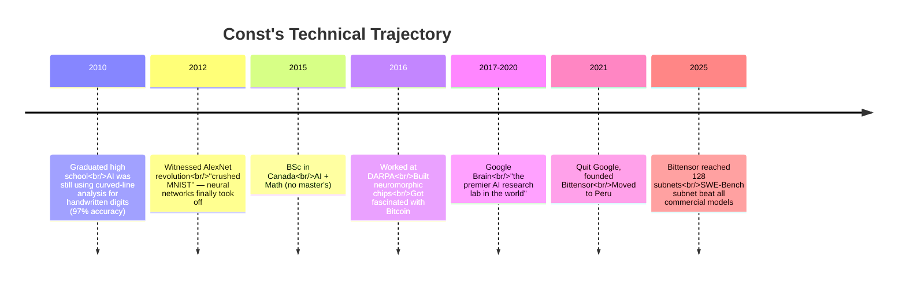

# Const (Jacob Steeves)

  <strong>🌐 语言 / Language:</strong>
  
  

> **Role**: Founder of [[Bittensor]]. An engineer / thinker who fused three tracks — AI, neuromorphic chips, and Bitcoin — into one coherent thesis.

---

## Technical Trajectory

---

## Key Ideas / Contributions

1. **Unified Feedback-Loop Paradigm**
   Abstracted neural networks, reinforcement learning, genetic algorithms, biological adaptation, and Bitcoin mining into **one common structure**: State → Objective → Feedback → Adaptation → Loop. See [[About Bittensor 2025.en]].

2. **Named [[Incentive Computing.en]]**
   Formally christened "computing driven by economic incentives" as a **paradigm in its own right**, alongside ML/RL/genetic programming — not merely a byproduct of cryptocurrency.

3. **Bittensor Architecture**
   Abstracted Bitcoin's specific logic into [[Bittensor Subnet Architecture.en]] — a **general-purpose incentive computer** allowing any "what counts as valuable work" definition to be optimized by a permissionless global market.

4. **Yuma Consensus**
   The multi-validator calibration algorithm in the Bittensor protocol.

---

## Public Speaking Style

- **Doesn't sell tokens, doesn't talk price**: Opens with "I'm not here to sell you a digital currency."
- **First-principles reasoning**: Starts from 2010 AI history and works forward to why Bittensor must exist.
- **Sharp values**: Explicitly criticizes the centralized structure of closed-source AI (OpenAI: "3000 employees / $100B valuation / you'll never work there").
- **Academic + practitioner hybrid**: DARPA + Google Brain background gives weight, but delivery is not pedantic.

---

## Cross-Concept Map

| Concept Const cited | Link |
|---------------------|------|
| AlexNet revolution | [[About Bittensor 2025.en]] |
| Slime mold maze | [[About Bittensor 2025.en]] |
| Bitcoin as supercomputer | [[Bitcoin as Supercomputer.en]] |
| General incentive computer | [[Bittensor Subnet Architecture.en]] |
| Decentralized 70B training | [[Decentralized AI Training]] |
| Dynamic TAO meta-RL | [[Dynamic TAO]] |

---

## Primary Sources

- 📺 [[About Bittensor 2025.en]] · Hack Quest channel · 33:15
- 📍 Location: Peru
- 🏢 Company: Bittensor (URL TBD)
