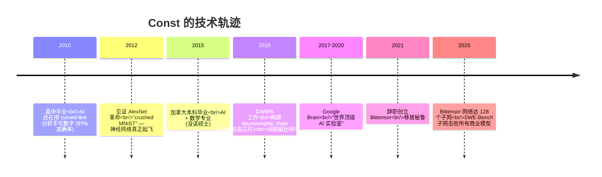

# Const (Jacob Steeves) · Bittensor 创始人

  <strong>🌐 语言 / Language:</strong>
  
  

> **身份**：[[Bittensor]] 创始人。一个把 AI + 神经形态芯片 + 比特币三条赛道汇成一条线的工程师/思想家。

---

## 技术轨迹

---

## 关键思想/贡献

1. **统一反馈循环范式**
   把神经网络、强化学习、遗传算法、生物适应、比特币挖矿**全部抽象成同一种结构**：State → Objective → Feedback → Adaptation → Loop。详见 [[About Bittensor 2025]]。

2. **命名 [[Incentive Computing]]**
   把"用经济激励驱动的计算"正式命名为一种**与机器学习并列的新范式**，而不仅仅是"加密货币的副产品"。

3. **Bittensor 设计**
   把比特币的具体逻辑抽象成 [[Bittensor Subnet Architecture]] —— 一种**通用激励计算机**，让任意 "什么是有价值的工作" 都能被一个全球无许可市场优化。

4. **Yuma Consensus**
   Bittensor 协议中的多验证者校准算法。

---

## 公开发言风格

- **不卖币、不谈价格**：开篇明确"我不是来卖给你们数字货币的"
- **从第一性原理讲技术**：从 2010 年 AI 史讲起，一路推导到为什么要做 Bittensor
- **价值观鲜明**：明确批判 OpenAI 等闭源 AI 的中心化结构（"3000 员工 / 100B 估值 / 你永远进不去"）
- **学术风格 + 实战经验混合**：DARPA + Google Brain 背景给观点底气，但表达不学究

---

## 跨概念定位

| Const 引用过的概念 | 链接 |
|------|------|
| AlexNet 革命 | [[About Bittensor 2025]] |
| 黏菌走迷宫 (slime mold maze) | [[About Bittensor 2025]] |
| 比特币是超级计算机 | [[Bitcoin as Supercomputer]] |
| 通用激励计算机 | [[Bittensor Subnet Architecture]] |
| 去中心化 70B 模型训练 | [[Decentralized AI Training]] |
| Dynamic TAO 元层级 RL | [[Dynamic TAO]] |

---

## 主要内容来源

- 📺 [[About Bittensor 2025]] · Hack Quest 频道 · 33:15
- 📍 居住地：秘鲁
- 🏢 公司：Bittensor (网址待补)
